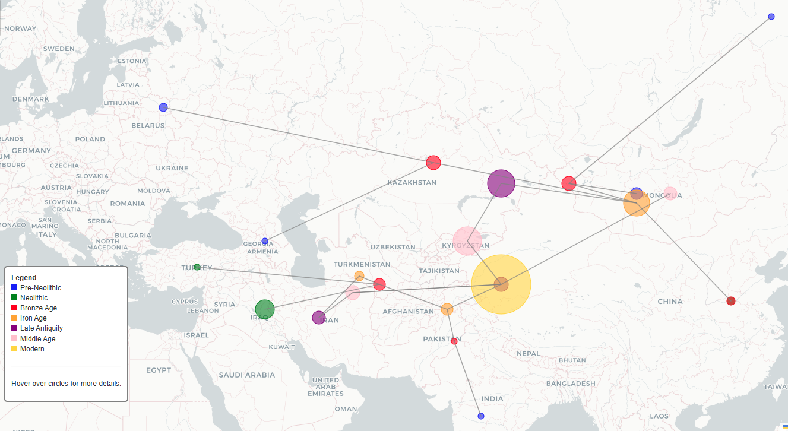
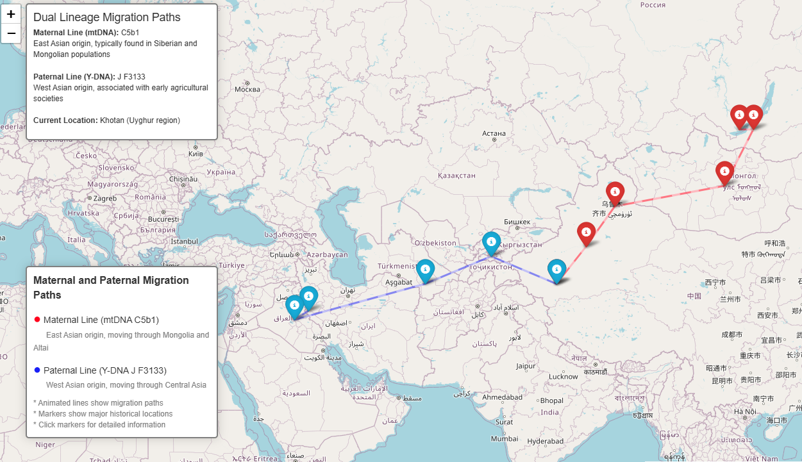
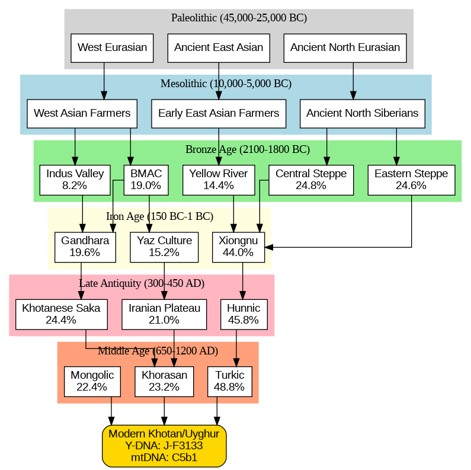
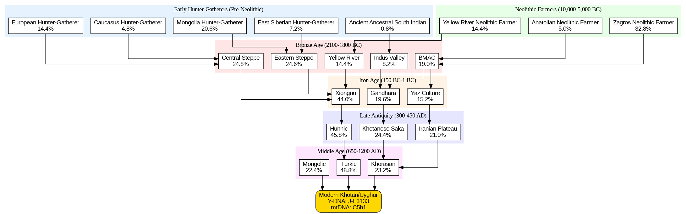
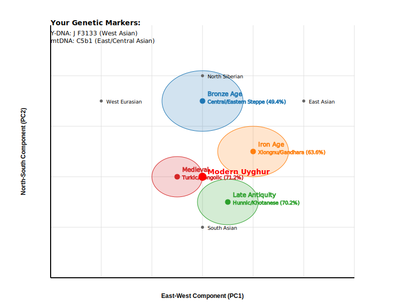

## Do you have your mtDNA and Y-DNA results, as well as IllustrativeDNA results categorized by historical periods and farming communities? If so, I can help you generate migration maps for just €5—an affordable and valuable service. Feel free to reach out if you're interested! https://x.com/Yusufrozimemet

# GPS-Uyghur
## Autosomal DNA migration analysis

You can view the interactive migration map [here](https://github.com/Yusuprozimemet/GPS-Uyghur/blob/main/ancestry_migration_map.html)

## Maternal-Paternal lineage migration analysis

You can view the interactive migration map [here](https://github.com/Yusuprozimemet/GPS-Uyghur/blob/main/dual_lineage_migration_map.html)

## Autosomal DNA general analysis

## Autosomal DNA detail analysis

The genetic admixture of the Ashkenazi Jews is remarkably consistent worldwide. The primary genetic influences are from Anatolian Neolithic Farmers and Indo-Europeans. Additionally, Zagros Neolithic Farmers and Levantine components are notable, with a small percentage of Caucasus Hunter Gatherers also evident.
In scenarios where Ashkenazi Jews remained longer in Central Asia, the contributions from Zagros Neolithic Farmers became more pronounced, while the Indo-European components decreased. Conversely, a migration further east resulted in an increase in Siberian Hunter Gatherer components.
Research indicates at least two major waves of admixture in Uyghur genetics. The first wave involved Indo-European admixture with local groups, followed by a second wave involving Turkic (Siberian Hunter Gatherer) admixture.

