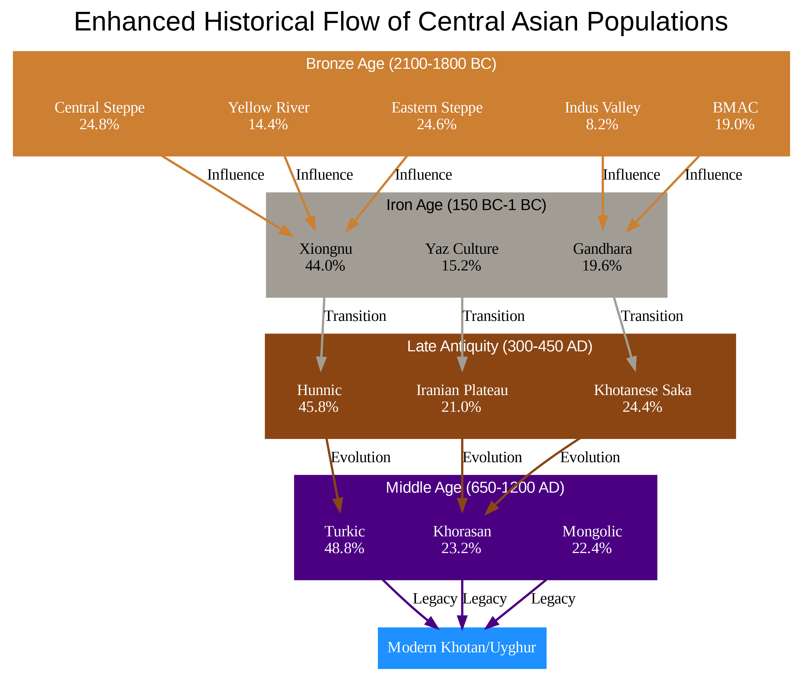
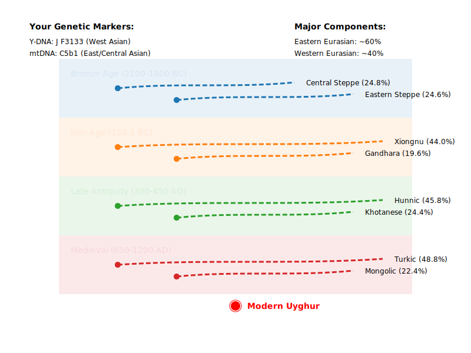

# GPS-Uyghur

## Autosomal DNA analysis

## Maternal-Paternal lineage migration analysis

You can view the interactive migration map [here](https://github.com/Yusuprozimemet/GPS-Uyghur/blob/main/dual_lineage_migration_map.html)

## My Specific Haplogroups
- **Y-haplogroup J (F3133):** Traces back to West Asian origins, suggesting a lineage from that area.
- **mtDNA C5b1:** Indicative of East and Central Asian ancestry, highlighting another directional influence on my genetic makeup.

## Visualizing Migration
- **Blue Lines:** Represent the movements during the Bronze Age from the steppes and BMAC.
- **Orange Lines:** Depict the Iron Age influence of the Xiongnu and Gandhara cultures.
- **Green Lines:** Mark the migrations in Late Antiquity associated with the Huns.
- **Red Lines:** Show the medieval expansion of Turkic populations.

This intricate genetic tapestry beautifully encapsulates why the **Uyghur language and identity** are a unique blend of **Eastern and Western Eurasian cultural and genetic influences**.

