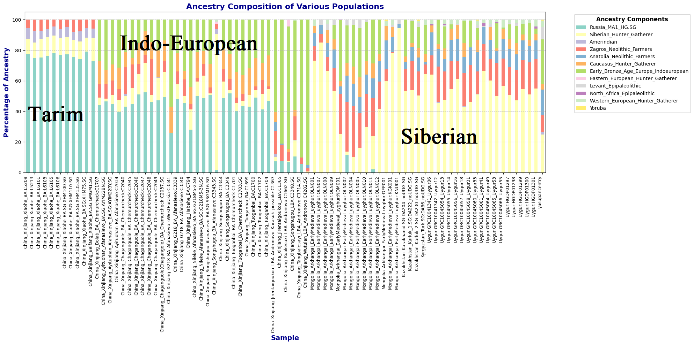

## Do you have your mtDNA and Y-DNA results, as well as IllustrativeDNA results categorized by historical periods and farming communities? If so, I can help you generate migration maps for €200 —an affordable and valuable service. Feel free to reach out if you're interested! https://x.com/Yusufrozimemet

# GPS-Uyghur
## Autosomal DNA migration analysis

You can view the interactive migration map [here](https://github.com/Yusuprozimemet/GPS-Uyghur/blob/main/ancestry_migration_map.html)

## Maternal-Paternal lineage migration analysis

You can view the interactive migration map [here](https://github.com/Yusuprozimemet/GPS-Uyghur/blob/main/dual_lineage_migration_map.html)

## Other researches and my own Research indicates at least two major waves of admixture in Uyghur genetics. The first wave involved Indo-European admixture with local groups, followed by a second wave involving Turkic (Siberian Hunter Gatherer) admixture.

## Autosomal DNA general analysis

## Autosomal DNA detail analysis

